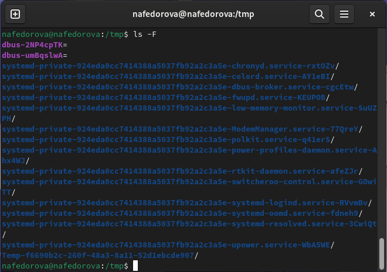
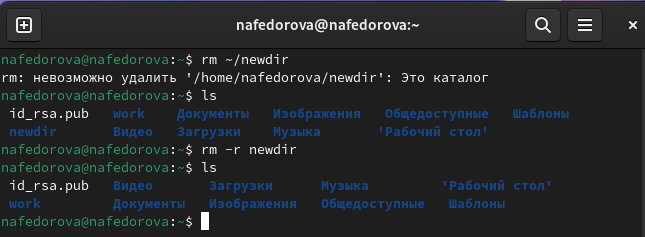
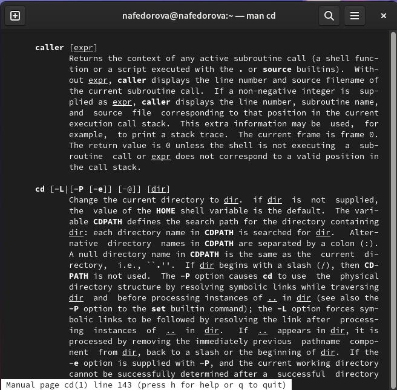

---
## Front matter
title: "Отчет по лабораторной работе №4:"
subtitle: "Основы интерфейса взаимодействия пользователя с системой Unix на уровне командной строки"
author: "Федорова Наталия Артемовна"

## Generic otions
lang: ru-RU
toc-title: "Содержание"

## Bibliography
bibliography: bib/cite.bib
csl: pandoc/csl/gost-r-7-0-5-2008-numeric.csl

## Pdf output format
toc: true # Table of contents
toc-depth: 2
lof: true # List of figures
lot: true # List of tables
fontsize: 12pt
linestretch: 1.5
papersize: a4
documentclass: scrreprt
## I18n polyglossia
polyglossia-lang:
  name: russian
  options:
	- spelling=modern
	- babelshorthands=true
polyglossia-otherlangs:
  name: english
## I18n babel
babel-lang: russian
babel-otherlangs: english
## Fonts
mainfont: PT Sans
romanfont: PT Sans
sansfont: PT Sans
monofont: PT Sans
mainfontoptions: Ligatures=TeX
romanfontoptions: Ligatures=TeX
sansfontoptions: Ligatures=TeX,Scale=MatchLowercase
monofontoptions: Scale=MatchLowercase,Scale=0.9
## Biblatex
biblatex: true
biblio-style: "gost-numeric"
biblatexoptions:
  - parentracker=true
  - backend=biber
  - hyperref=auto
  - language=auto
  - autolang=other*
  - citestyle=gost-numeric
## Pandoc-crossref LaTeX customization
figureTitle: "Рис."
tableTitle: "Таблица"
listingTitle: "Листинг"
lofTitle: "Список иллюстраций"
lotTitle: "Список таблиц"
lolTitle: "Листинги"
## Misc options
indent: true
header-includes:
  - \usepackage{indentfirst}
  - \usepackage{float} # keep figures where there are in the text
  - \floatplacement{figure}{H} # keep figures where there are in the text
---

# Цель работы

Приобретение практических навыков взаимодействия пользователя с системой посредством командной строки.

# Задание

1. Определите полное имя вашего домашнего каталога. Далее относительно этого каталога будут выполняться последующие упражнения.

2. Выполните следующие действия:

* Перейдите в каталог /tmp.

* Выведите на экран содержимое каталога /tmp. Для этого используйте команду ls с различными опциями. Поясните разницу в выводимой на экран информации.

* Определите, есть ли в каталоге /var/spool подкаталог с именем cron?

* Перейдите в Ваш домашний каталог и выведите на экран его содержимое. Определите, кто является владельцем файлов и подкаталогов?

3. Выполните следующие действия:

* В домашнем каталоге создайте новый каталог с именем newdir.

* В каталоге ~/newdir создайте новый каталог с именем morefun.

* В домашнем каталоге создайте одной командой три новых каталога с именами letters, memos, misk. Затем удалите эти каталоги одной командой.

* Попробуйте удалить ранее созданный каталог ~/newdir командой rm. Проверьте, был ли каталог удалён.

* Удалите каталог ~/newdir/morefun из домашнего каталога. Проверьте, был ли каталог удалён.

4. С помощью команды man определите, какую опцию команды ls нужно использовать для просмотра содержимое не только указанного каталога, но и подкаталогов, входящих в него.

5. С помощью команды man определите набор опций команды ls, позволяющий отсортировать по времени последнего изменения выводимый список содержимого каталога с развёрнутым описанием файлов.

6. Используйте команду man для просмотра описания следующих команд: cd, pwd, mkdir, rmdir, rm. Поясните основные опции этих команд.

7. Используя информацию, полученную при помощи команды history, выполните модификацию и исполнение нескольких команд из буфера команд.

# Теоретическое введение

Приведём основные команды Unix, которые мы будем использовать в процессе выполнения лабораторной работы №4.

В табл. @tbl:std-dir приведен краткий справочник по командам терминала Unix-систем.

: Краткий справочник по командам терминала GNU Linux {#tbl:std-dir}

| Имя команды | Описание команды                                                                                                          |
|--------------|----------------------------------------------------------------------------------------------------------------------------|
| `cd`          | Служит для перемещения по файловой системе                                                                               |
| `ls`      | Выводит список файлов, входящих в каталог     |
| `pwd`       | Печатает полное название директории, в которой находится пользователь                                           |
| `mkdir`      | Служит для создания новых каталогов |
| `rm`     | Удаление файлов и каталогов                                                                                   |
| `rmdir`      | Удаление пустых каталогов                                                                              |
| `man`       | Выводит руководство по использованию команд |
| `history`       | Служит для просмотра истории введённых команд и их модификации                                                                                 |

# Выполнение лабораторной работы

1. Для того, чтобы определить полное имя домашнего каталога, ввожу в терминале команду **pwd**.

2. С помощью команды **cd /tmp** перехожу в данную папку и командой **ls** вывожу содержимое папки без какой-либо дополнительной информации (рис. [-@fig:001]).

{#fig:001 width=100%}

Используя команду **ls -l** получаю уже не просто список файлов, а также их владельца, дату последнего изменения (рис. [-@fig:002]).
    
{#fig:002 width=100%}

Команда **ls -a** выводит список всех файлов, даже скрытых (рис. [-@fig:003]).
    
{#fig:003 width=100%}

Комбинация **ls -alF** сортирует данные файлы по папкам и для наглядности ставит слэш (/) после каждой, так же выводит подробную информацию о файлах и показывает скрытые файлы и папки (рис. [-@fig:004]).

{#fig:004 width=100%}

Параметр **-F** выводит список всех файлов, сортируя их по папкам и ставит слэш для удобной визуализации (рис. [-@fig:005]).
    
{#fig:005 width=100%}

Определяю, есть ли подкаталог с именем **cron**  в каталоге **/var/spool**. Для этого сначала перехожу в каталог командой **cd /var/spool**, а затем использую команду **ls**. Подкаталога **cron** нет (рис. [-@fig:006]).
    
{#fig:006 width=100%}

Вывожу содержимое домашнего каталога. Перехожу командой **cd** и использую команду **ls -l**, чтобы посмотреть, кто владелец. Владельцем всех файлов и каталогов являюсь я.

3. В домашнем каталоге создаю каталог с именем **newdir**, использую команду **mkdir**, и проверяю ее наличие с помощью **ls** (рис. [-@fig:007]).

{#fig:007 width=100%}

Далее перехожу в новый каталог и создаю новый каталог с именем **morefun** теми же командами.

Создаю одной командой в домашнем каталоге 3 новых директории с определёнными именами (letters, memos, misk), а затем удаляю их одной командой. Для этого использую команды **mkdir letters memos misk** и **rmdir letters memos misk** соответственно, и обязательно проверяю их наличие или отсутствие командой **ls** (рис. [-@fig:008]). 

{#fig:008 width=100%}

Попробую удалить ранее созданный каталог **~/newdir** командой **rm**, но данный каталог не будет удален, поскольку данная команда предназначена для удаления файлов. Удалим каталог **~/newdir/morefun** из домашнего каталога. Для этого будем использовать рекурсивное удаление каталога (рис. [-@fig:009]).
    
{#fig:009 width=100%}

4. Необходимо узнать, какую опцию команды **ls** нужно использовать для просмотра содержимое не только указанного каталога, но и подкаталогов, входящих в него. Использую команду **man ls** и вижу, что для этого можно использовать опцию **-R** (рис. [-@fig:010]).

{#fig:010 width=100%}

5. Узнаю набор опций команды **ls**, позволяющий отсортировать по времени последнего изменения выводимый список содержимого каталога с развёрнутым описанием файлов. В данном случаем подойдет опция **-c** (рис. [-@fig:011]).

{#fig:011 width=100%}

6. При помощи команды **man** узнаю опции следующих команд: 

- cd: Служит для перемещения по каталогам. Её аргумент - директория, в которую желает переместиться пользователь (рис. [-@fig:012]).

{#fig:012 width=100%}

- pwd: Cлужит для вывода полного названия директории, в которой находится пользователь (рис. [-@fig:013]).

{#fig:013 width=100%}

- mkdir: Служит для создания директорий (рис. [-@fig:014]).

{#fig:014 width=100%}

- rmdir: Удаляет пустые каталоги (рис. [-@fig:015]).

{#fig:015 width=100%}

- rm: Удаляет файлы и каталоги (рис. [-@fig:016]).

{#fig:016 width=100%}

7. При помощи команды **history** выполняю модификацию и исполнение некоторой команды из буфера команд (рис. [-@fig:017]).

{#fig:017 width=100%}

# Контрольные вопросы

1. **Что такое командная строка?**

Командная строка (или интерфейс командной строки) - это текстовый интерфейс, который позволяет пользователю взаимодействовать с операционной системой или приложением путем ввода текстовых команд. В операционных системах, таких как Windows, macOS и различных дистрибутивах Linux, командная строка предоставляет возможность запускать программы, управлять файлами, настраивать систему и выполнять другие задачи с помощью команд и параметров, вводимых с клавиатуры.

2. **При помощи какой команды можно определить абсолютный путь текущего каталога? Приведите пример.** 

Определить абсолютный путь текущего каталога можно с помощью команды pwd (PrintWorkingDirectory). Это вернет абсолютный путь текущего каталога, например: /home/user/documents.

3. **При помощи какой команды и каких опций можно определить только тип файлов и их имена в текущем каталоге? Приведите примеры.**

Для определения только типов файлов и их имен в текущем каталоге можно использовать команду "ls". Для получения более подробной информации о типах файлов имен можно использовать опцию "-F" для отображения в виде списка с дополнительными деталями. Например, использование команды ls -F в папке lab04/report даст нам следующее: bib/ image/ Makefile pandoc/ report.md. Мы видим. что bib/, image/, pandoc/ - это папки, а Makefile и report.md - файлы.

4. **Каким образом отобразить информацию о скрытых файлах?**

Для отображения информации о скрытых файлах можно использовать команду "ls" с опцией "-a". Опция "-a" позволяет отобразить все файлы, включая скрытые, которые обычно начинаются с точки.

5. **При помощи каких команд можно удалить файл и каталог? Можно ли это сделать одной и той же командой? Приведите примеры.**

Для удаления файлов в командной строке используется команда "rm" (remove), а для удаления каталогов используется команда "rmdir" или "rm" с опцией "-r" для рекурсивного удаления.

- Удаление файла: rm filename.txt

- Удаление каталога (если он пуст): rmdir directoryname

- Рекурсивное удаление каталога (включая все файлы и подкаталоги внутри): rm -r directoryname

6. **Каким образом можно вывести информацию о последних выполненных пользователем командах работы?**

Информацию о последних выполненных пользователем командах можно просмотреть с помощью команды "history". Эта команда выводит список последних выполненных команд в терминале, каждая сопровождается номером.

7. **Как воспользоваться историей команд для их модифицированного выполнения? Приведите примеры.**

Для выполнения модифицированных команд из истории можно воспользоваться символом "!" с номером строки истории, содержащей нужную команду. Также можно использовать различные опции для модификации и повторного выполнения предыдущих команд.

- Выполнение предыдущей команды: !!

Это выполнит немодифицированную версию последней команды.

- Выполнение команды по номеру в истории: !123

Это выполнит команду, которая была под номером 123 в истории.

- Выполнение команды с определенным текстом: !ls

Это выполнит последнюю команду, начинающуюся с "ls" из истории.

8. **Приведите примеры запуска нескольких команд в одной строке.**

Можно запускать несколько команд в одной строке, используя разделитель ";". Этот метод позволяет последовательно выполнять несколько команд.

- Выполнение нескольких команд последовательно: mkdir new_directory; cd new_directory; touch new_file.txt

В этом примере сначала создается новый каталог "new_directory", затем происходит переход в этот каталог, и наконец создается новый файл "new_file.txt".

- Комбинирование команд с условным выполнением: make build && make install

В этом примере команда "make install" будет выполнена только в случае успешного завершения команды "make build".

- Использование логического оператора "или": rm file1.txt || echo "File not found"

В этом примере, если файл "file1.txt" не найден, будет выведено сообщение "File not found".

9. **Дайте определение и приведите примера символов экранирования.**

Символ экранирования в программировании и командной строке используется для изменения значения другого символа. Обычно это достигается путем добавления обратной косой черты ("\") перед символом, который требуется экранировать.

- Экранирование кавычек: echo "It's a beautiful day"

Для использования апострофа внутри строки в командной строке, его можно экранировать с помощью обратной косой черты: echo "It"\"'s a beautiful day"

- Экранирование пробелов:

В командной строке, если требуется работать с файлом, имя которого содержит пробелы, необходимо экранировать пробелы в имени файла: cat my"\" file.txt

- Экранирование специальных символов:

Например, в регулярных выражениях, для экранирования специальных символов, таких как точка (.), используется обратная косая черта: grep "end\." file.txt

Символ экранирования позволяет использовать специальные символы или управляющие последовательности в тексте без изменения их значения или поведения.

10. **Охарактеризуйте вывод информации на экран после выполнения команды ls с опцией l.**

Команда "ls" с опцией "-l" используется для вывода информации о файлах и каталогах в виде списка с дополнительными деталями. После выполнения этой команды, на экран будет выведена подробная информация о файлах и каталогах в текущем каталоге.

Обычно вывод содержит следующие столбцы:

- Тип файла и разрешения доступа.

- Количество ссылок на файл или каталог.

- Имя пользователя-владельца.

- Имя группы-владельца.

- Размер файла в байтах.

- Дата и время последней модификации.

- Имя файла или каталога.

11. **Что такое относительный путь к файлу? Приведите примеры использования относительного и абсолютного пути при выполнении какой-либо команды.**

Относительный путь к файлу - это путь, который указывает на местоположение файла относительно текущего рабочего каталога. Он не начинается с корневого каталога и используется для указания пути к файлу или каталогу относительно текущего местоположения.

Пример использования относительного пути:

Если текущий каталог находится по адресу "/home/user/", а нужный файл находится в подкаталоге "documents", то относительный путь к файлу "report.txt" будет выглядеть так: "documents/report.txt".

Абсолютный путь к файлу - это полный путь к файлу от корневого каталога файловой системы. Он всегда начинается с корневого каталога и указывает на точное местоположение файла в файловой системе.

Пример использования абсолютного пути:

Если файл "data.txt" находится в каталоге "/home/user/documents", то его абсолютный путь будет "/home/user/documents/data.txt".

12. **Как получить информацию об интересующей вас команде?**

Чтобы получить информацию о конкретной команде, можно воспользоваться несколькими способами:

- Команда man:

В большинстве случаев можно использовать команду "man" (от "manual") с названием интересующей команды, чтобы получить подробное описание и справку по этой команде. Например: man ls

Это отобразит руководство по команде "ls", включая ее опции и примеры использования.

- Команда --help:

Многие команды поддерживают опцию "--help", которая выводит краткую справку по команде и ее опциям. Например: ls --help

Это выведет краткую справку по команде "ls" и доступным опциям.

13. **Какая клавиша или комбинация клавиш служит для автоматического дополнения вводимых команд?**

Для автоматического дополнения вводимых команд используется клавиша "Tab". При вводе начала команды или пути к файлу можно нажать клавишу "Tab", и система автоматически дополнит набранное до уникально определяемой команды или пути.

# Выводы

В данной лабораторной работе мы приобрели практические навыки взаимодействия пользователя с системой посредством командной строки.

::: {#refs}
:::
