---
## Front matter
title: "Отчет по лабораторной работе №6:"
subtitle: "Поиск файлов. Перенаправление ввода-вывода. Просмотр запущенных процессов"
author: "Федорова Наталия Артемовна"

## Generic otions
lang: ru-RU
toc-title: "Содержание"

## Bibliography
bibliography: bib/cite.bib
csl: pandoc/csl/gost-r-7-0-5-2008-numeric.csl

## Pdf output format
toc: true # Table of contents
toc-depth: 2
lof: true # List of figures
lot: true # List of tables
fontsize: 12pt
linestretch: 1.5
papersize: a4
documentclass: scrreprt
## I18n polyglossia
polyglossia-lang:
  name: russian
  options:
	- spelling=modern
	- babelshorthands=true
polyglossia-otherlangs:
  name: english
## I18n babel
babel-lang: russian
babel-otherlangs: english
## Fonts
mainfont: PT Sans
romanfont: PT Sans
sansfont: PT Sans
monofont: PT Sans
mainfontoptions: Ligatures=TeX
romanfontoptions: Ligatures=TeX
sansfontoptions: Ligatures=TeX,Scale=MatchLowercase
monofontoptions: Scale=MatchLowercase,Scale=0.9
## Biblatex
biblatex: true
biblio-style: "gost-numeric"
biblatexoptions:
  - parentracker=true
  - backend=biber
  - hyperref=auto
  - language=auto
  - autolang=other*
  - citestyle=gost-numeric
## Pandoc-crossref LaTeX customization
figureTitle: "Рис."
tableTitle: "Таблица"
listingTitle: "Листинг"
lofTitle: "Список иллюстраций"
lotTitle: "Список таблиц"
lolTitle: "Листинги"
## Misc options
indent: true
header-includes:
  - \usepackage{indentfirst}
  - \usepackage{float} # keep figures where there are in the text
  - \floatplacement{figure}{H} # keep figures where there are in the text
---

# Цель работы

Ознакомление с инструментами поиска файлов и фильтрации текстовых данных. Приобретение практических навыков: по управлению процессами (и заданиями), по проверке использования диска и обслуживанию файловых систем.

# Задание

1. Запишите в файл file.txt названия файлов, содержащихся в каталоге /etc. Допишите в этот же файл названия файлов, содержащихся в вашем домашнем каталоге.

2. Выведите имена всех файлов из file.txt, имеющих расширение .conf, после чего запишите их в новый текстовой файл conf.txt.

3. Определите, какие файлы в вашем домашнем каталоге имеют имена, начинавшиеся с символа c? Предложите несколько вариантов, как это сделать.

4. Выведите на экран (по странично) имена файлов из каталога /etc, начинающиеся с символа h.

5. Запустите в фоновом режиме процесс, который будет записывать в файл ~/logfile файлы, имена которых начинаются с log.

6. Удалите файл ~/logfile.

7. Запустите из консоли в фоновом режиме редактор gedit.

8. Определите идентификатор процесса gedit, используя команду ps, конвейер и фильтр grep. Как ещё можно определить идентификатор процесса?

9. Прочтите справку (man) команды kill, после чего используйте её для завершения процесса gedit.

10. Выполните команды df и du, предварительно получив более подробную информацию об этих командах, с помощью команды man.

11. Воспользовавшись справкой команды find, выведите имена всех директорий, имеющихся в вашем домашнем каталоге.

# Теоретическое введение

Приведём основные команды Unix, которые мы будем использовать в процессе выполнения лабораторной работы №6.

В табл. @tbl:std-dir приведен краткий справочник по командам терминала Unix-систем.

: Краткий справочник по командам терминала GNU Linux {#tbl:std-dir}

| Имя команды | Описание команды                                                                                                         |
|--------------|----------------------------------------------------------------------------------------------------------------------------|
| `команда 1 | команда 2`          |    Конвейер                                                 |
| `find путь [-опции]`      | Поиск файла     |
| `grep строка имя_файла`       |    Фильтрация текста                                        |
| `df [-опции] [файловая_система]`      |  Показывает размер каждого смонтированного раздела диска |
| `du [-опции] [имя_файла...]`    | Показывает число килобайт, используемое каждым файлом или каталогом |                                                                                  |
| `kill %номер задачи`      | Завершение задачи                                                                                    |
| `ps [-опции]`       | Получение информации о процессах                |

# Выполнение лабораторной работы

1. Запиcала в файл file.txt названия файлов, содержащихся в каталоге /etc, используя команду `ls -lR /etc > file.txt`. В этот же файл добавила названия файлов, содержащихся в моем домашнем каталоге с помощью `ls -lR >> file.txt`. После с помощью команды `cat file.txt` проверяю содержимое (рис. [-@fig:001]).

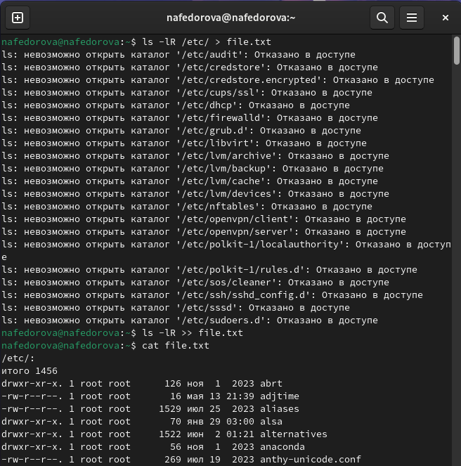{#fig:001 width=100%}

2. Вывожу имена всех файлов из file.txt, имеющих расширение .conf, после чего записала их в новый текстовой файл conf.txt. Для этого ввела команду `cat file.txt | grep .conf > conf.txt`(рис. [-@fig:002]).

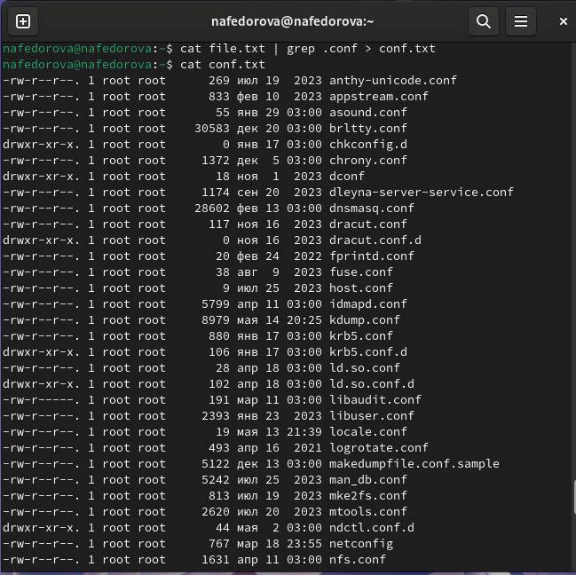{#fig:002 width=100%}

3. Определяю, какие файлы в моем домашнем каталоге имеют имена, начинавшиеся с символа 'c'. Сначала использую вариант `ls | grep c*`, а потом нахожу с помощью `find /etc -name "h*" -print` (рис. [-@fig:003]).
    
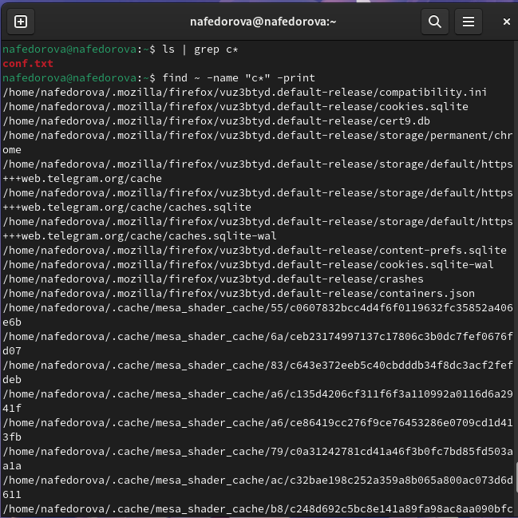{#fig:003 width=100%}

4. Вывожу на экран имена файлов из каталога /etc, начинающиеся с символа "h", используя команду `find ~ -name "c*" -print` (рис. [-@fig:004]).
    
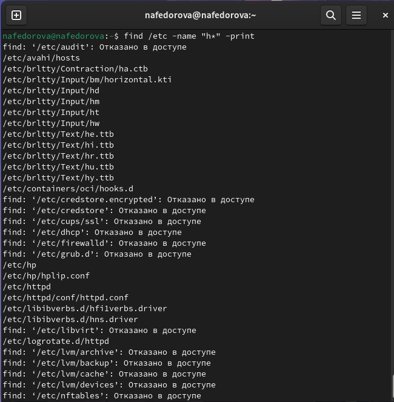{#fig:004 width=100%}

5. Запускаю в фоновом режиме процесс, который будет записывать в файл ~/logfile файлы, имена которых начинаются с "log". Для этого использую `find ~ -name "log*" -print > logfile &`. (рис. [-@fig:005]).

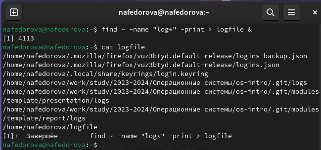{#fig:005 width=100%}

6. Теперь удаляю файл ~/logfile, используя `rm logfile` (рис. [-@fig:006]).
    
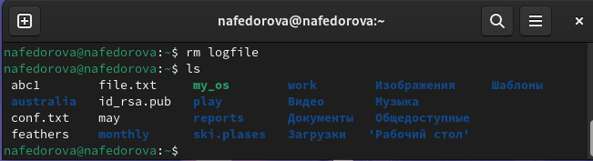{#fig:006 width=100%}

7. Запускаю из консоли в фоновом режиме редактор gedit с помощью команды `gedit &` (рис. [-@fig:007]).
    
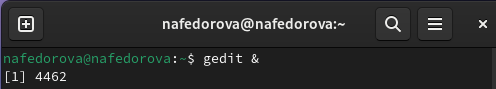{#fig:007 width=100%}

8. Определяю идентификатор процесса gedit, конвейер и фильтр grep. Можно использовать команду `ps`, чтобы вывести все процессы, а если хочу увидеть определенный процесс, то ввожу `ps aux | grep gedit`. В моем случае идентификатор процесса gedit равен 4462 (рис. [-@fig:008]).
    
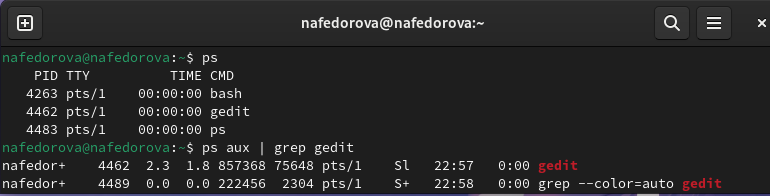{#fig:008 width=100%}

9. Читаю справку (man) команды kill, после чего использую её для завершения процесса gedit (рис. [-@fig:009]) (рис. [-@fig:010]).
    
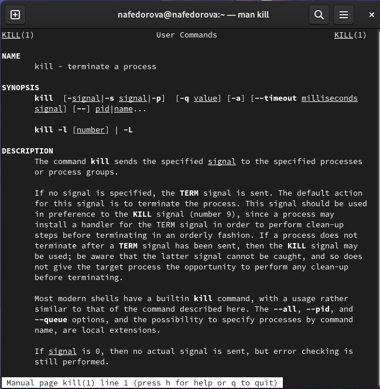{#fig:009 width=100%}
    
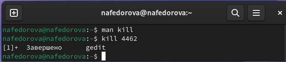{#fig:010 width=100%}

10. Читаю более подробную информацию о командах df и du, с помощью команды man. Выполняю команды df и du.(рис. [-@fig:011]) (рис. [-@fig:012]).

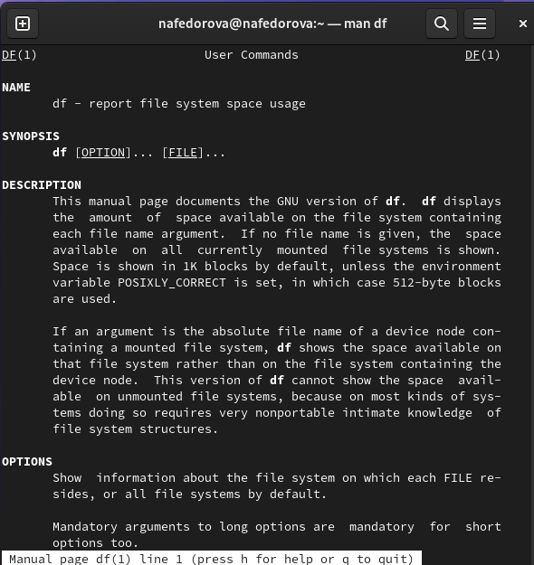{#fig:011 width=100%}
    
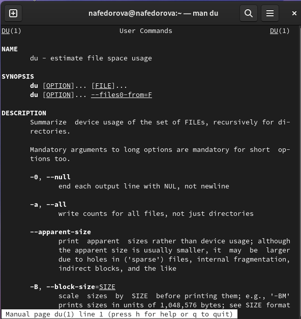{#fig:012 width=100%}

Команда **df** используется для отображения информации о дисковом пространстве на файловых системах, включая общий объем, использованный объем, доступное пространство и место, занятое системными файлами.

Команда **du** используется для оценки использования дискового пространства файлами и каталогами в Linux. По умолчанию du показывает использование дискового пространства для текущего каталога (рис. [-@fig:013]).

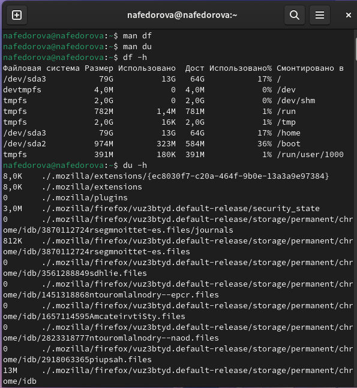{#fig:013 width=100%}

11. Воспользовавшись справкой команды find, вывожу имена всех директорий, имеющихся в моем домашнем каталоге, использовав команду `find -type d` (рис. [-@fig:014]) (рис. [-@fig:015]).

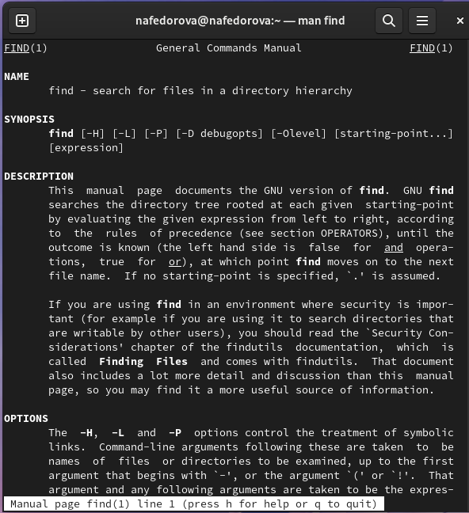{#fig:014 width=100%}

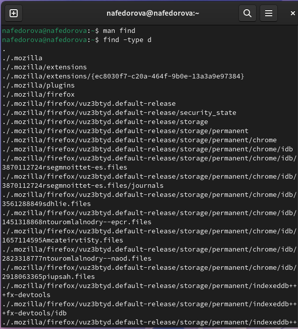{#fig:015 width=100%}

# Контрольные вопросы

1. **Какие потоки ввода вывода вы знаете?**

Существует несколько потоков ввода-вывода в UNIX-подобных операционных системах, таких как:

- **Стандартный ввод (stdin)** - поток, через который процесс принимает ввод.

- **Стандартный вывод (stdout)** - поток, через который процесс выводит результат.

- **Стандартный поток ошибок (stderr)** - поток, через который процесс выводит сообщения об ошибках.

2. **Объясните разницу между операцией > и >>.**

Операция `>` используется для перенаправления вывода команды в файл, при этом файл будет перезаписан, если уже существует. Операция `>>` также перенаправляет вывод команды в файл, но добавляет вывод в конец файла, не перезаписывая его.

3. **Что такое конвейер?**

Конвейер (pipeline) - это механизм в UNIX, позволяющий объединить вывод одной команды с вводом другой команды без использования промежуточных файлов. Это позволяет создавать цепочки команд для выполнения сложных задач

4. **Что такое процесс? Чем это понятие отличается от программы?**

Процесс - это исполняющаяся программа во время выполнения на компьютере. Процесс включает в себя код программы, данные, которые программа использует, а также ресурсы системы, необходимые для её выполнения, такие как память, файлы и устройства ввода-вывода.

Программа, с другой стороны, это статический набор инструкций, написанный на языке программирования, который описывает алгоритм для выполнения определённой задачи. Программа становится процессом только во время выполнения, когда операционная система выделяет ей ресурсы и начинает исполнять её инструкции.

Таким образом, основное различие между процессом и программой заключается в том, что программа представляет собой статический набор инструкций, тогда как процесс - это программа во время выполнения, которая активно использует ресурсы системы для выполнения своих задач.

5. **Что такое PID и GID?**

PID (Process ID) и GID (Group ID) - это два идентификатора, используемых в операционных системах для управления процессами и пользователями.

- **PID (Process ID)** - это уникальный идентификатор, который присваивается каждому процессу в операционной системе. PID используется для отслеживания, управления и завершения процессов. Когда процесс запускается, операционная система присваивает ему уникальный PID, который остается постоянным в течение жизненного цикла процесса.

- **GID (Group ID)** - это идентификатор, который присваивается группе пользователей в операционной системе. Группы пользователей используются для управления доступом к файлам, ресурсам и другим объектам в системе. Каждый пользователь может быть членом одной или нескольких групп, и GID используется для определения, к какой группе относится пользователь.

6. **Что такое задачи и какая команда позволяет ими управлять?**

Задачи (jobs) - это процессы, запущенные в фоновом режиме в командной оболочке. Команда `jobs` используется для просмотра списка задач и управления ими.

7. **Найдите информацию об утилитах top и htop. Каковы их функции?**

Утилиты `top` и `htop` предоставляют информацию о процессах, выполняемых в системе, и ресурсах, которые они используют. `top` - это стандартная утилита, а `htop` представляет более удобный интерфейс для мониторинга процессов.

8. **Назовите и дайте характеристику команде поиска файлов. Приведите примеры использования этой команды.**

Команда поиска файлов в UNIX-подобных системах - `find`. Она используется для поиска файлов и каталогов в указанном месте с заданными критериями. Пример использования: `find /path/to/directory -name "*.txt"`.

9. **Можно ли по контексту (содержанию) найти файл? Если да, то как?**

Да, можно найти файл по его содержанию с помощью команды `grep`. Пример: `grep "search_term" file.txt`.

10. **Как определить объем свободной памяти на жёстком диске?**

Чтобы определить объем свободной памяти на жестком диске, можно использовать команду `df -h`.

11. **Как определить объем вашего домашнего каталога?**

Чтобы определить объем вашего домашнего каталога, можно воспользоваться командой `du -sh ~`.

12. **Как удалить зависший процесс?**

Чтобы удалить зависший процесс, можно воспользоваться командой `kill -9 PID`, где PID - идентификатор процесса, который нужно завершить.

# Выводы

В данной лабораторной работе я ознакомились с инструментами поиска файлов и фильтрации текстовых данных. Приобрела практические навыки: по управлению процессами(и заданиями), по проверке использования диска и обслуживанию файловых систем.

::: {#refs}
:::
